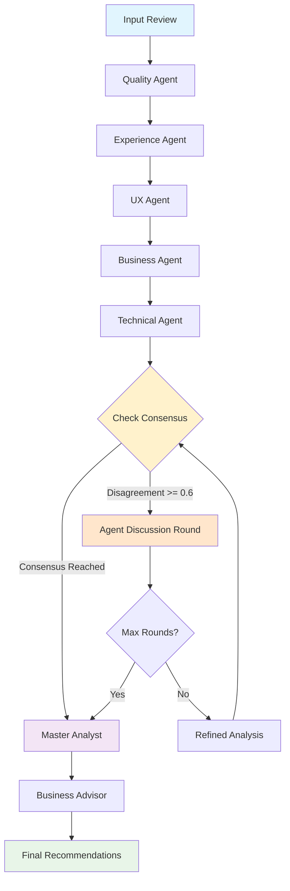

# Hệ thống Multi-Agent AI cho Phân tích Cảm xúc Khách hàng

**Multi-Agent AI System for Customer Sentiment Analysis**

🤖 **Kiến trúc 3 tầng** | 🔗 **A2A Protocol** | 🎯 **Phân tích thời gian thực** | 📊 **Pipeline dữ liệu động**

---

## 📋 **Giới thiệu**

Hệ thống phân tích cảm xúc khách hàng sử dụng kiến trúc multi-agent AI với 3 tầng chuyên biệt:

- **Tầng 1 - Các Agent Chuyên môn**: Quality, Experience, UX, Business, Technical
- **Tầng 2 - Master Analyst**: Tổng hợp và phân tích từ các department
- **Tầng 3 - Business Advisor**: Đưa ra khuyến nghị kinh doanh cụ thể

### **Tính năng chính:**
- ✅ Thu thập dữ liệu từ YouTube và Tiki
- ✅ Phân tích cảm xúc theo từng khía cạnh chuyên môn
- ✅ Giao tiếp agent qua JSON-RPC 2.0 (A2A Protocol)
- ✅ Giao diện web Streamlit trực quan
- ✅ Hỗ trợ nhiều loại sản phẩm (Electronics, Fashion, Beauty, etc.)

---

## 🏗️ **Kiến trúc Hệ thống (LangGraph Workflow)**



---

## 🚀 **Quick Start**

### 1. Cài đặt dependencies
```bash
pip install -r requirements.txt
```

### 2. Cấu hình môi trường
```bash
# Tạo file .env
echo "OPENAI_API_KEY=your_openai_api_key_here" > .env

# Tạo file config.json và thêm vào nội dụng:
{
  "api_key": "your_openai_api_key",
  "model_name": "gpt-4o-mini",
  "youtube_api_key": "your_youtube_api_key",
  "youtube_max_videos": 5,
  "youtube_max_comments": 30
}

```

### 3. Chọn cách chạy hệ thống

#### **🤖 Option B: LangGraph Auto-Scraping (Recommended)**
```bash
# Chạy LangGraph với auto scraping từ YouTube + Tiki
python demo_langchain_system.py
```
- ✅ Tự động scrape dữ liệu theo keyword
- ✅ LangGraph discussion-based workflow
- ✅ Phân tích từng review riêng lẻ
- ✅ Business recommendations tự động

#### **🎯 Option A: Multi-Agent Manual**
```bash
# Chạy 3-layer workflow với input thủ công
python demo_enhanced_system.py
```
- ✅ Workflow 3 tầng: Department → Master → Business Advisor
- ✅ Test nhiều loại review khác nhau
- ✅ Hiển thị chi tiết disagreement giữa các agent
- ✅ Interactive menu để test các tính năng

#### **📊 Option C: Multi-Review Summary Analysis**
```bash
# Tổng hợp nhiều review → phân tích 1 lần
python demo_langchain_system_summary.py
```
- ✅ Scrape nhiều review cùng lúc
- ✅ Kết hợp tất cả review thành 1 dataset
- ✅ Phân tích tổng thể comprehensive
- ✅ Business insights từ toàn bộ dataset

#### **🌐 Option D: Streamlit Web Interface (Original)**
```bash
# Giao diện web trực quan - phiên bản gốc
streamlit run app.py
```
- ✅ UI thân thiện, dễ sử dụng
- ✅ Chọn agent types và product categories
- ✅ Real-time analysis results
- ✅ 3-layer workflow traditional

#### **🚀 Option E: A2A Streamlit Interface (Recommended)**
```bash
# 1. Start A2A coordinator (must run first)
python rpc_servers/langgraph_coordinator_rpc.py

# 2. Start A2A Streamlit app (in separate terminal)
streamlit run app_a2a.py --server.port 8512
```
- ✅ **Same UI/UX as app.py** - giao diện hoàn toàn giống nhau
- ✅ **A2A Protocol backend** - JSON-RPC 2.0 compliant, enterprise ready
- ✅ **LangGraph consensus & debate** - agents discuss và reach consensus automatically
- ✅ **Disagreement detection** - automatic conflict resolution with discussion rounds
- ✅ **Distributed architecture** - microservices ready, scalable
- ✅ **Enhanced error handling** - comprehensive health checks và troubleshooting
- ✅ **Windows compatible** - tested và working on Windows systems

#### **🔗 Option F: Individual A2A Agent Servers**
```bash
# Chạy các agent riêng lẻ (JSON-RPC endpoints)
python scripts/start_agents.py
```
- ✅ Microservice architecture
- ✅ JSON-RPC 2.0 endpoints
- ✅ Scalable agent communication
- ✅ Perfect for integration

---

## 💻 **Cách sử dụng**

### **Streamlit Interface**

#### **Traditional Interface (app.py)**
1. Mở trình duyệt tại `http://localhost:8501`
2. Chọn loại sản phẩm (Electronics, Fashion, etc.)
3. Nhập review cần phân tích
4. Chọn chế độ phân tích (Coordinator/Individual/Sequential)

#### **A2A Interface (app_a2a.py) - Recommended**
1. **Start A2A Coordinator**: `python rpc_servers/langgraph_coordinator_rpc.py`
   - Coordinator starts on port 8010
   - Check health: `curl http://localhost:8010/health`
   - Wait for "🚀 Starting LangGraph Multi-Agent Coordinator RPC Server" message
   
2. **Start A2A App**: `streamlit run app_a2a.py --server.port 8512`
   - App available at `http://localhost:8512`
   - Uses port 8512 to avoid conflicts with traditional app (8501)
   
3. **Interface Features**:
   - **Same UI/UX as app.py** - familiar interface với enhanced backend
   - **A2A protocol** - JSON-RPC 2.0 với LangGraph coordinator
   - **Multi-agent consensus** - automatic disagreement detection & discussion
   - **Enhanced error handling** - comprehensive health checks
   - **Real-time feedback** - detailed progress indicators & status updates

4. **Quick Test**: Visit browser, enter review, see comprehensive analysis results

### **A2A Protocol API**
```python
import requests

# Gọi Quality Agent
payload = {
    "jsonrpc": "2.0",
    "id": "test-123",
    "method": "tasks/send",
    "params": {
        "id": "test-123",
        "message": {
            "role": "user",
            "parts": [{"type": "text", "text": "Sản phẩm chất lượng tuyệt vời!"}]
        },
        "metadata": {
            "product_category": "electronics",
            "max_tokens": 150
        }
    }
}

response = requests.post("http://localhost:8001/rpc", json=payload)
result = response.json()
```

### **Workflow Manager**
```python
from workflow_manager import MultiAgentWorkflowManager

# Tạo workflow manager
manager = MultiAgentWorkflowManager(
    product_category="electronics",
    max_tokens_per_department=150
)

# Phân tích review
result = manager.run_analysis("Điện thoại tuyệt vời nhưng giao hàng chậm")
print(f"Sentiment: {result['master_analysis']['sentiment']}")
```

---

## 📁 **Cấu trúc Project**

```
multi-ai-agents-for-sentiment-analysis/
├── 📂 agents/                      # Các agent chuyên môn
│   ├── sentiment_agents.py         # Implementation các agent
│   ├── langgraph_coordinator.py    # LangGraph coordinator
│   └── prompts/                    # Agent prompts
├── 📂 data_pipeline/               # Thu thập & xử lý dữ liệu
│   ├── scrapers.py                 # YouTube & Tiki scrapers
│   ├── preprocessor.py             # Text preprocessing
│   └── pipeline.py                 # Data pipeline chính
├── 📂 rpc_servers/                 # A2A JSON-RPC endpoints
│   ├── quality_agent_rpc.py        # Quality agent endpoint
│   ├── experience_agent_rpc.py     # Experience agent endpoint
│   └── coordinator_agent_rpc.py    # Coordinator endpoint
├── 📂 evaluation/                  # Testing & evaluation
├── 📂 scripts/                     # Automation scripts
├── 📄 app.py                       # Streamlit web interface
├── 📄 workflow_manager.py          # Workflow orchestration
└── 📄 config.json                  # System configuration
```

---

## ⚙️ **Configuration**

### **config.json**
```json
{
  "model_name": "gpt-4o-mini",
  "api_key": "your_openai_api_key",
  "youtube_api_key": "your_youtube_api_key",
  "youtube_max_videos": 5,
  "youtube_max_comments": 30
}
```

### **Agent Ports (A2A Mode)**
- Quality Agent: `http://localhost:8001/rpc`
- Experience Agent: `http://localhost:8002/rpc`
- UX Agent: `http://localhost:8003/rpc`
- Business Agent: `http://localhost:8004/rpc`
- Technical Agent: `http://localhost:8005/rpc`
- Coordinator: `http://localhost:8000/rpc`

---

## 🧪 **Development & Testing**

### **Chạy tests**
```bash
# Unit tests
pytest tests/ -v

# Integration tests
python scripts/test_a2a_workflow.py

# Health check
python scripts/start_agents.py --health-check
```

### **Evaluation**
```bash
# Comprehensive evaluation
python evaluation/evaluation_script.py

# Quick test
python evaluation/quick_test.py
```

---

## 🎯 **Loại sản phẩm hỗ trợ**

- **Electronics**: Điện thoại, laptop, đồ điện tử
- **Fashion**: Quần áo, giày dép, phụ kiện
- **Beauty & Health**: Mỹ phẩm, chăm sóc sức khỏe
- **Home & Garden**: Đồ gia dụng, trang trí nhà
- **Sports & Outdoors**: Thể thao, dụng cụ ngoài trời
- **Books & Media**: Sách, phim, âm nhạc

---

## 🔧 **Troubleshooting**

### **Lỗi thường gặp:**
1. **OpenAI API Error**: Kiểm tra API key trong `config.json` và `.env`
2. **Port conflicts**: Thay đổi port trong `scripts/start_agents.py`
3. **Memory issues**: Giảm `max_tokens` trong config
4. **Slow response**: Kiểm tra kết nối mạng và API limits

### **A2A Specific Issues:**
1. **"Connection refused"**: A2A coordinator chưa chạy → `python rpc_servers/langgraph_coordinator_rpc.py`
2. **"A2A coordinator error: None"**: ✅ Đã fix - error checking logic cải thiện
3. **"Timeout not available"**: Windows limitation - không ảnh hưởng chức năng  
4. **Port 8010 in use**: Kill process và restart coordinator
5. **API key mismatch**: Coordinator sử dụng .env, app sử dụng config.json
6. **Import errors**: Đảm bảo `pip install langgraph` và dependencies đầy đủ

### **Debug mode:**
```bash
# Test A2A coordinator (comprehensive test)
python test_a2a_quick_fix.py

# Check coordinator health
curl http://localhost:8010/health
# Expected: {"status": "healthy", "agent": "langgraph_coordinator", "version": "1.0.0"}

# Test OpenAI API key
python -c "import os; from dotenv import load_dotenv; load_dotenv(); print('API Key loaded:', bool(os.getenv('OPENAI_API_KEY')))"

# Check running processes on ports
netstat -ano | findstr :8010  # A2A coordinator
netstat -ano | findstr :8512  # Streamlit A2A app
netstat -ano | findstr :8501  # Traditional Streamlit app

# Kill process if needed (Windows)
# taskkill /PID <PID> /F
```

### **Performance Tips:**
```bash
# Fast A2A (2 agents, minimal discussion):
metadata = {
    "agent_types": ["quality", "experience"], 
    "max_discussion_rounds": 1,
    "disagreement_threshold": 0.8
}

# Balanced A2A (3 agents, moderate discussion):
metadata = {
    "agent_types": ["quality", "experience", "business"], 
    "max_discussion_rounds": 2,
    "disagreement_threshold": 0.6
}

# Thorough A2A (all 5 agents, full discussion):
metadata = {
    "agent_types": ["quality", "experience", "user_experience", "business", "technical"], 
    "max_discussion_rounds": 3,
    "disagreement_threshold": 0.4
}
```

### **A2A vs Traditional Mode:**
| Feature | Traditional (app.py) | A2A (app_a2a.py) |
|---------|---------------------|-------------------|
| Backend | Direct Python calls | JSON-RPC 2.0 A2A protocol |
| Agent Communication | Sequential processing | LangGraph consensus workflow |
| Disagreement Handling | Static conflict resolution | Dynamic discussion rounds |
| Scalability | Single process | Microservices ready |
| UI/UX | Streamlit interface | **Identical UI/UX** |
| Performance | Faster (no RPC overhead) | Slightly slower (better consensus) |
| Debugging | Python stack traces | JSON-RPC logs + health checks |
| Architecture | Monolithic | Distributed, enterprise-ready |

---

## 📊 **So sánh 3 Approach chính**

### **🎯 Approach A: Multi-Agent Manual**
```bash
python demo_enhanced_system.py
```
**Input**: "Điện thoại iPhone 15 Pro Max chất lượng tuyệt vời, camera siêu đẹp nhưng giá hơi cao và giao hàng chậm"

**Output**:
- **Quality Agent**: Positive (0.85) - "Chất lượng sản phẩm xuất sắc"
- **Experience Agent**: Negative (0.70) - "Giao hàng chậm ảnh hưởng trải nghiệm"
- **UX Agent**: Positive (0.80) - "Người dùng hài lòng với chức năng"
- **Business Agent**: Neutral (0.65) - "Giá cao có thể ảnh hưởng doanh số"
- **Master Analysis**: Positive (0.75) - "Tổng thể tích cực với một số điểm cần cải thiện"
- **Business Recommendations**: "Cải thiện tốc độ giao hàng, xem xét chính sách giá"

### **🤖 Approach B: LangGraph Auto-Scraping**
```bash
python demo_langchain_system.py
```
**Input**: Nhập keyword "iPhone 15" → Auto scrape từ YouTube + Tiki

**Output**:
```
🔍 Found 6 reviews
🔄 Discussion rounds: 2
🤝 Consensus reached: Yes
🎯 Final sentiment: POSITIVE (0.82)
💼 BUSINESS RECOMMENDATIONS: Focus on delivery speed improvement and pricing strategy optimization
⏱️ Processing time: 15.2s
```

### **📊 Approach C: Multi-Review Summary**
```bash
python demo_langchain_system_summary.py
```
**Input**: Nhập keyword "iPhone 15" → Scrape 10 reviews → Combine thành 1 dataset

**Output**:
```
📈 Dataset: 10 customer reviews analyzed
🔄 Discussion rounds: 3
📊 Sentiment Distribution: {'positive': 6, 'neutral': 3, 'negative': 1}
🎯 MASTER ANALYST: POSITIVE (0.78)
💼 COMPREHENSIVE BUSINESS RECOMMENDATIONS:
   • HIGH PRIORITY: Improve delivery logistics (mentioned in 7/10 reviews)
   • MEDIUM PRIORITY: Pricing strategy review (mentioned in 4/10 reviews)
   • LOW PRIORITY: Camera feature enhancement (mentioned in 2/10 reviews)
   • BUSINESS IMPACT: Estimated 15% customer satisfaction increase
📊 Confidence: 0.85
⏱️ Processing time: 32.8s
```

### **🎯 Khi nào dùng approach nào?**
- **Manual (A)**: Phân tích chi tiết 1 review, test tính năng, development
- **Auto-Scraping (B)**: Phân tích nhanh nhiều review riêng lẻ, research sản phẩm
- **Summary (C)**: Phân tích tổng thể thị trường, business intelligence, comprehensive insights

---
